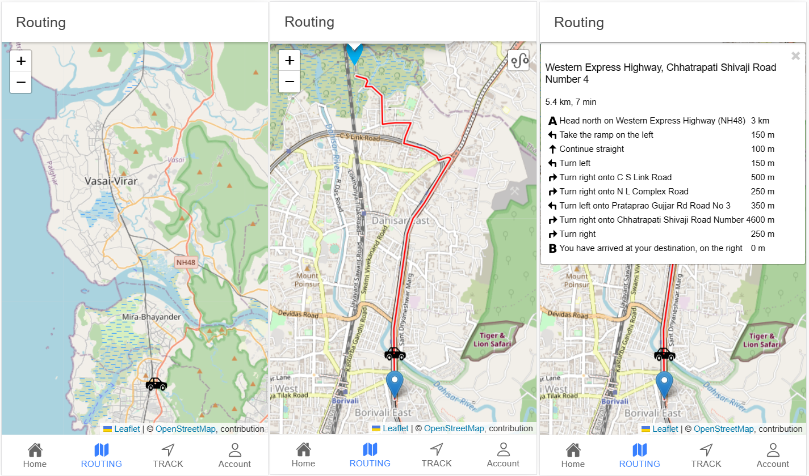

# Smart Mobility Solutions
Smart Mobility Solution is a quick and lasting resolution to issues
that frequently disrupts seamless and convenient transportation and causes
unnecessary delays for logistics and common people.

## Research Paper
<a href="https://ijsrem.com/download/intelligent-solution-to-urban-mobility-problems/">Link for the research paper</a> 

## Steps to run
* After downloading the repo, run npm install command in admin_app, driver_app and user_app.
* to start the backend, run mvnw or ./mvnw in backend folder
* to start admin_app, driver_app and user_app , run npm start in admin_app, driver_app and user_app folder respectively.
* for admin login , username : admin , password : admin
* for user login , username : user , password : user

## Technical Diagrams
Project Flow Diagram 
 
Activity Diagram 
 
Data Flow Diagram 
 
ER Diagram 
 
Use Case Diagram 
 

## Screenshots

### Login Module

### Routing Module

### Other Module

### Admin Module Features
Deliveries Module 
 
Fleets Module 
 
Graphs 
 
Home 
 
Parcel Module 
 

### Driver Module Features
Home 
 
New Driver Form 
 
Job Module 
 
Graph & Emergency Module 
 

### User Module Features
Home 
 
Parcel Module 
 
 
Rating Module 
 

